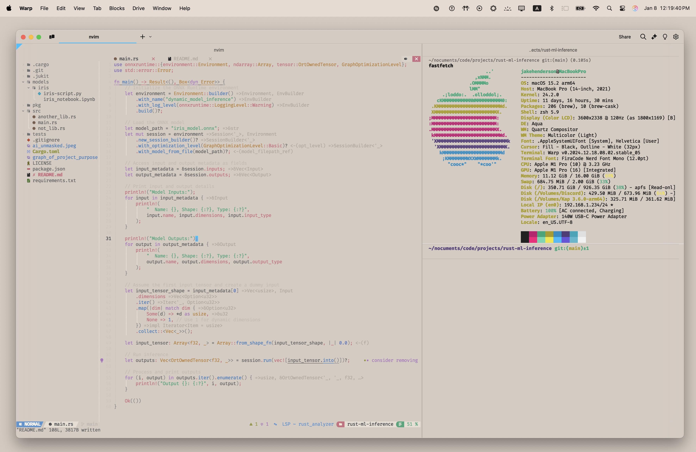
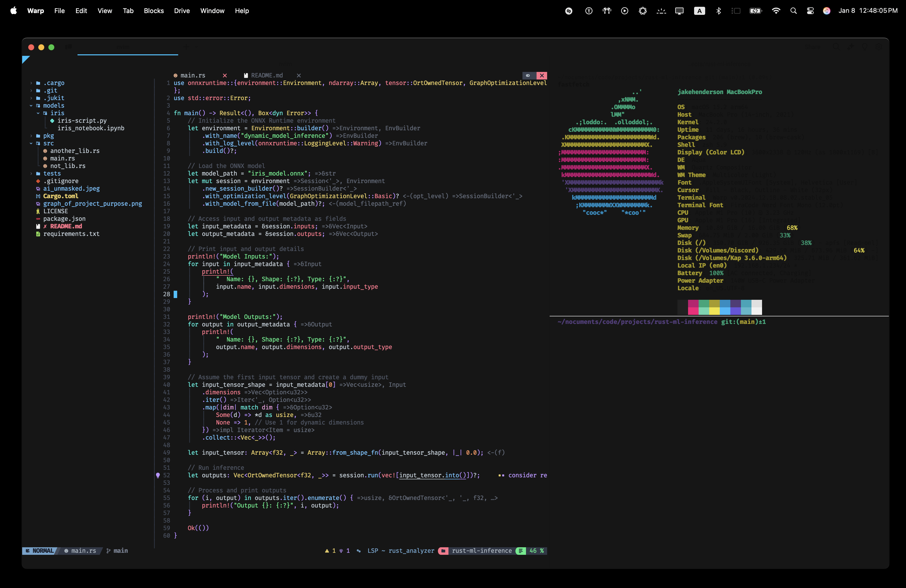
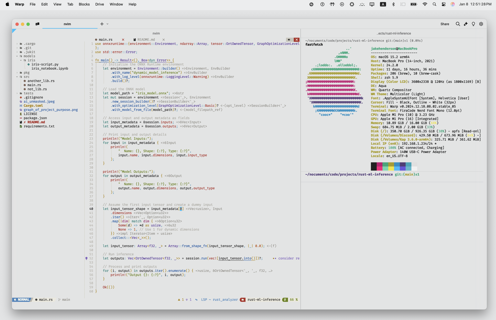

# nvim_configs
neo vim configurations
this is configured with NV chad







# NVChad Python Development Setup

## Python Features

### Language Server Protocol
- **Pyright**: Static type checking and code intelligence
- **Ruff**: Fast Python linter with auto-fixes
- **MyPy**: Optional stricter type checking

### Code Formatting
- **Black**: PEP8-compliant code formatter 
- **isort**: Import sorting and organization

### Debugging
- Full **debugpy** integration with breakpoints and variable inspection
- Three debug configurations (normal, with args, pytest)
- Virtual environment auto-detection

### Jupyter & REPL Integration
- **jupytext**: Edit Jupyter notebooks as Python files
- **jupynium**: Connect and control Jupyter notebooks within Neovim
- **iron.nvim**: Integrated Python/IPython REPL
- **magma-nvim**: TUI interface for Jupyter with inline outputs

## Configuration Files

### `lua/plugins/init.lua`
- Defines plugins to be installed by Lazy (plugin manager)
- Configures Mason's `ensure_installed` tools
- Sets up plugin dependencies and configurations
- Location for adding new plugins like Python debugger and Jupyter support

### `lua/configs/lspconfig.lua`
- Configures Language Server Protocols (LSPs)
- **Important**: Uses NVChad-specific paths (`require("nvchad.configs.lspconfig")`)
- Sets up Python LSPs (pyright and ruff)
- Inherits NVChad's default LSP configurations

### `lua/configs/conform.lua`
- Configures formatters by file type
- Setup for Python: isort + black for complete formatting

## Setup Commands

Run these commands in order:

1. `:Lazy sync`
   - Downloads and installs all plugins defined in `init.lua`
   - Updates existing plugins
   - Must be run after modifying `init.lua`

2. `:MasonInstallAll`
   - Installs all tools specified in Mason's `ensure_installed`
   - Includes LSP servers, formatters, and debuggers
   - Must be run after Lazy sync completes

3. Install Python dependencies:
   ```bash
   pip install jupytext jupyter ipython mypy black isort pynvim
   ```

## Verification Steps

1. Check LSP Status:
   ```
   :LspInfo
   ```
   Should show pyright and ruff as active for Python files

2. Test LSP Features:
   - `gd` - Go to definition
   - `K` - Hover documentation
   - `<leader>ca` - Code actions

3. Verify Debugger:
   - Set breakpoint: `<leader>db`
   - Start debugger: `<leader>dpd` (debug current Python file)

4. Test Python REPL:
   - Start REPL: `<leader>pr`
   - Send selection to REPL: `<leader>sc` (visual mode)
   - Send current line: `<leader>sl`

5. Test Jupyter Integration:
   - Open a Jupyter notebook (.ipynb file) with Neovim
   - Start Jupynium: `<leader>jn` 
   - Run cell: `<leader>jr`
   
6. Test Magma TUI Integration:
   - Open a Python file with cell markers (# %%)
   - Initialize Magma: `<leader>mi`
   - Evaluate a cell: `<leader>mc` then motion (like `ip` for paragraph)
   - Evaluate current line: `<leader>ml`
   - Show output: `<leader>mo`

## Common Issues

### Path-Related Problems

- Always use `require("nvchad.configs.lspconfig")` instead of `require("plugins.configs.lspconfig")`
- NVChad uses its own path structure for core configurations
- Watch for error messages about missing modules - they often indicate incorrect paths

### Plugin Loading Issues

- If plugins aren't working, check `:checkhealth`
- Ensure you ran `:Lazy sync` after modifying `init.lua`
- Verify Mason installed all tools with `:Mason` and check the list

### Python Environment

- Ensure Python and pip are installed system-wide
- debugpy requires a Python environment to be available
- Jupyter features need both jupytext and jupyter installed
- For Python REPL functionality, make sure ipython is installed
- Auto-formatting requires both black and isort to be available

## Troubleshooting

1. If LSP isn't working:
   - Check `:LspInfo` in a Python file
   - Verify Mason installed the servers
   - Look for path-related errors in `:checkhealth`

2. If plugins aren't loading:
   - Run `:Lazy sync` again
   - Check `:Lazy` for plugin status
   - Verify plugin paths in `init.lua`

3. If Jupyter integration isn't working:
   - Ensure jupytext and jupyter are installed
   - Run `:checkhealth jupynium` to check dependencies
   - Make sure the Python path is correctly set

4. If Magma-nvim isn't working:
   - Ensure pynvim is installed (`pip install pynvim`)
   - Run `:checkhealth provider` to verify Python support
   - You may need to run `:UpdateRemotePlugins` after installation

5. If REPL isn't working:
   - Make sure ipython is installed
   - Try `:IronRepl` manually to see any error messages 
   - Check if your virtual environment is properly detected

6. For formatting issues:
   - Verify black and isort are installed
   - Check the output of `:ConformInfo` for formatter status
